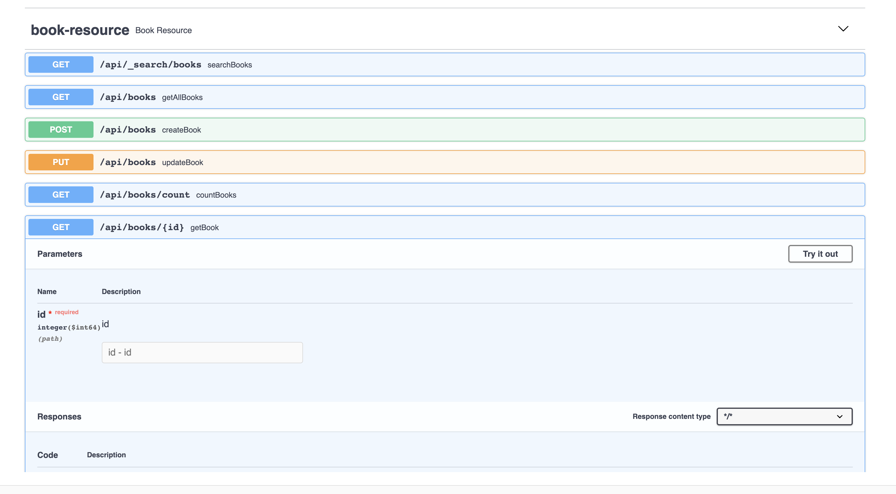
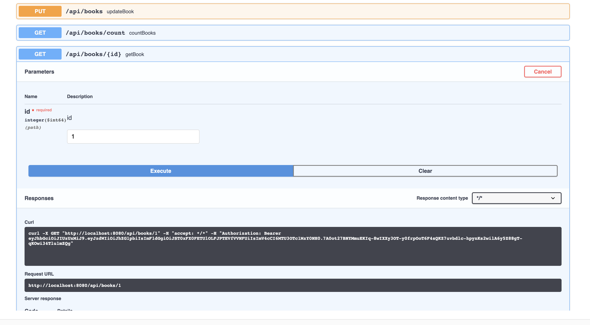

# Library System Backend REST API

    npm install
    ./mvnw
    npm start

## Login
    username: admin
    password: admin
    
## API Documentation
    Go to:
        -Admin
        -API
        

## Testing

To launch your application's tests, run:

    ./mvnw verify

### Client tests

Unit tests are run by Jest and written with Jasmine. They're located in [src/test/javascript/](src/test/javascript/) and can be run with:

    npm test
